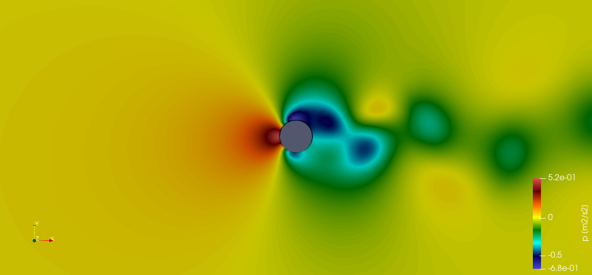
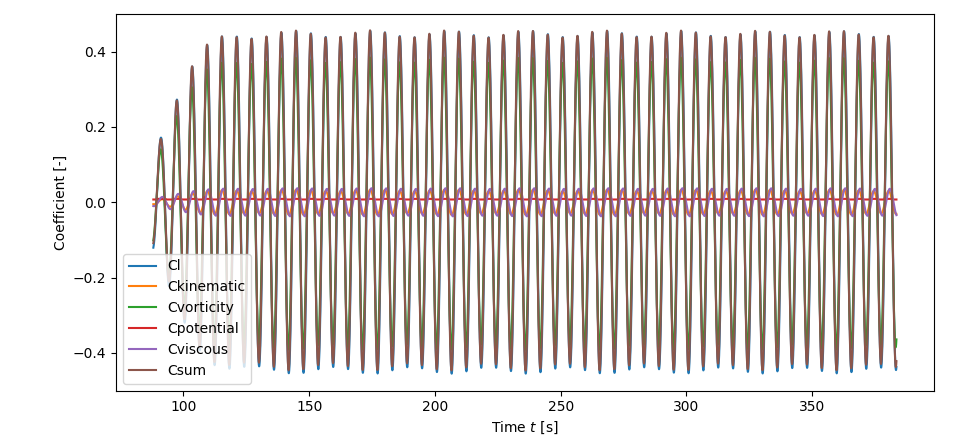

# HPB-VIV
Research Project about Vortex-induced Vibrations

# Introduction
You can read the unpublished article on the implementation and results in 


**Figure:** Vortex-shedding with circular cylinder.

**Figure:** Artist impression of vortex-induced vibrations.


# Installation
To use the code snippets in this explanation, first set a variable to the local directory where this repository is stored

```bash
export VIV_HOME=<path-to-this-repo> # substitute appropriate path.
```

In order to use the custom libraries, go into the `openFoam-VIV/src/` directory
and make the libraries with `wmake`:

```bash
cd $VIV_HOME/openFoam-VIV/src/
wmake libso fpmBoundaryConditions/
wmake libso fpmForcePart/
wmake fpmPimpleFoam/
```

> For some weird reason, the trailing white line in
> `fpmPimpleFoam/Make/options` keeps disappearing. This causes problems
> when compiling on the cluster!

> Furthermore, I noticed that you **have to compile in the master
> node**, otherwise, the functionObject is not found!!

alternatively, the `Allwmake` script can be used to do the same thing
```bash
cd $VIV_HOME/openFoam-VIV/src/
./Allwmake
```


The above will store the `fpmBoundaryConditions.so` library and the  `libfpmForcePart.so` function object library in your `$FOAM_USER_LIBBIN` and the `fpmPimpleFoam` application in `$FOAM_USER_APPBIN`. They can then be used within any of your openFOAM cases.

If you wish to use the post-processing scripts easily, it is best to
add the fpm-scripts directory to your path.

```bash
export PATH=$PATH:$VIV_HOME/fpm-scripts
```

# Usage


## Will Explain Later
* Include boundary conditions library in `system/controlDict`

    ```c++
    libs("libfpmBoundaryConditions.so");
    ```
* Put `Phi` and `PhiI` entries in `system/fvSolution`. An example is shown.
    ```c++
    solvers
    {
        // ...
        Phi
        {
            solver          GAMG;
            smoother        DIC;

            tolerance       1e-06;
            relTol          0.01;
        }
        PhiFinal
        {
            $Phi;
        }
        PhiI
        {
            $Phi
        }
        PhiIFinal
        {
            $Phi
        }

    }
    ```

* Add `PhiI` field in `constant/PhiI`. This is only a temporary solution, but as long as I haven't figured out how to have it in the runtime directory, this is how it will be. An example is shown below.
    ```c++
    // ...
    boundaryField
    {
        // ...
        // Use zeroGradient on the boundaries, except if this is not possible
        // empty, symmetry, ... should of course be consistent with the mesh.
        CYLINDER
        {
            type            fpmPotentialGradient;
            gradientVec     (0 1 0);
        }
    }
    // ...
    ```

* More!

    ```c++
    TODO:
    ```
## Force Partitioning
To use this implementation of the Menon2020 force-partitioning, make sure
to add a section to the `<case>/system/controlDict` file. An example is shown below.

```c++
fpmForcePart_object
{
    type fpmForcePart;
    libs ("libfpmForcePart.so");
    
    patches (CYLINDER); // patches ("body1" "body2" "body3");

    enabled     true; // Switch to avoid commenting this whole section.
    log true;

    rhoInf 1.0;

    CofR (0.0 0 0);
    liftDir (0 1 0);
    dragDir (1 0 0);

    fpmForcePartDir (0 1 0); THIS MUST BE A UNIT VECTOR!

    magUInf 1.0;
    lRef 1.0; // Reference length for the Re number (diameter)

    writeControl   timeStep;
    writeInterval  1;
}
```

then run using the `fpmPimpleFoam` solver from your case directory. For serial execution use
```bash
fpmPimpleFoam > log
```
and for parallel excecution on N processors, use either of the following two
```bash
mpirun -np N fpmPimpleFoam -parallel > log
mpiexec -n N fpmPimpleFoam -parallel > log
```

The calculated coefficients will then be stored in `<case>/postProcessing/fpmForceCoeffs/<time>/fpmForcePartCoefficient.dat`.

> This description is **not complete** !

## Plot coefficients
To easily plot the coefficients, add the `fpm-scripts` directory to your path (see [Installation](#installation)). After that, you can run the `fpmPlotOutput.py` script to plot any of the coefficient files. Use the `--help` option to see how that command works.

For example:
```bash
cd <case>/postProcessing/fpmForcePart_object/<startTime>/
fpmPlotCoeffs fpmForcePartCoefficient.dat
```
will produce a plot like the one below.



# Athor
* Simon Van Hulle (TU Delft)

